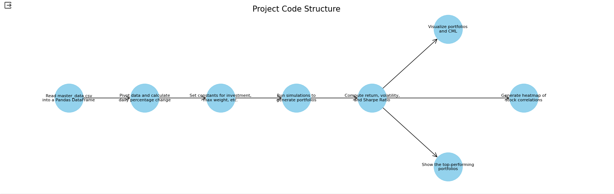
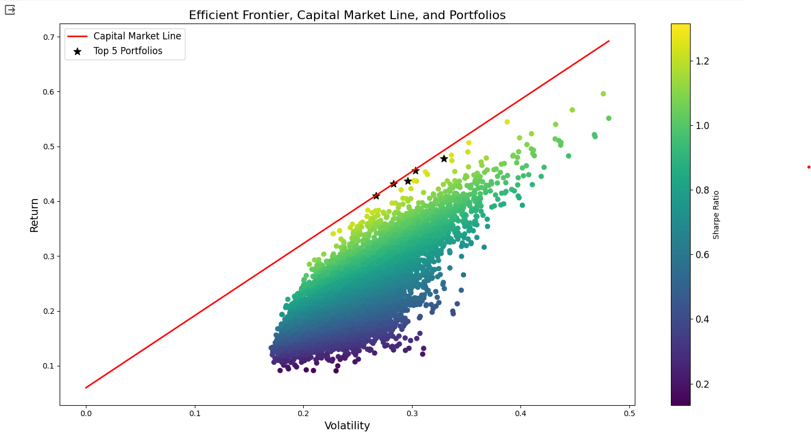
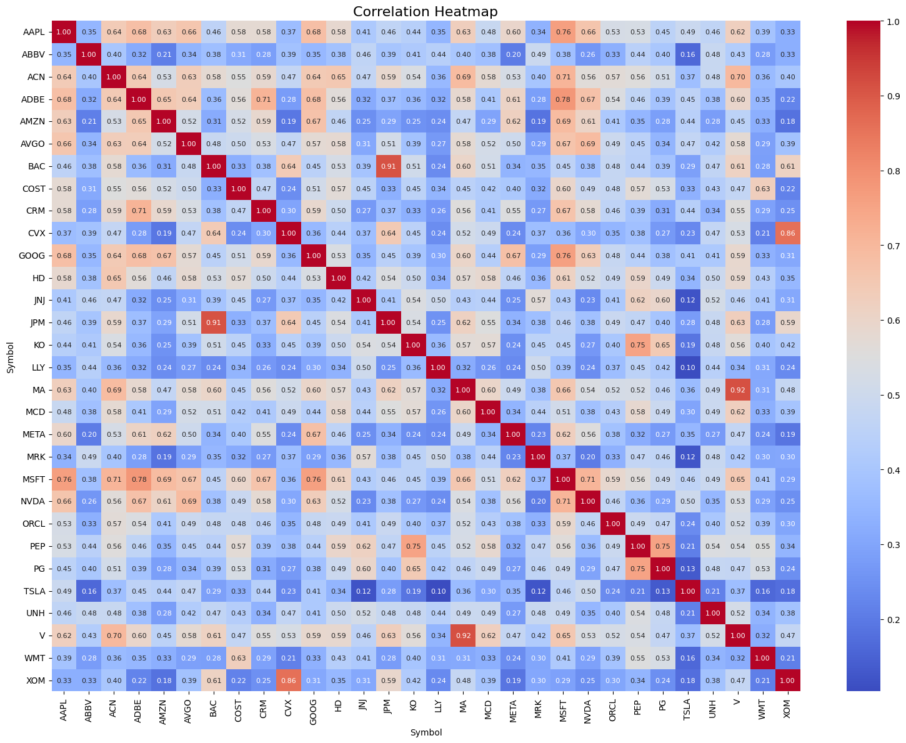
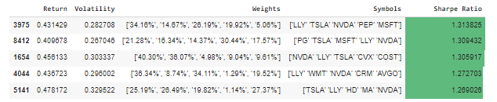

# **ZenWealth**

## **Repository Contents:**

| Item | Description |
| ---- | ----------- |
| Top Level README | Project's report and description |
| Efficient Frontier Portfolio Optimization | Jupyter notebook to execute code |
| datagenerator.py | Generates data points for master_data.csv file |
| master_data.csv | Stores data points for stocks |

## **Inspiration:**

We are planning on making investment planning software. 
Software for planning things contributes to happiness by helping organize your life and taking away from chaos. 
The software will implement statistical and graph algorithms to decide how to allocate money to invest into assets. 
We will use Minimum Spanning Tree (MST) algorithm to find correlations between different stocks using clustering methods and edge distance between nodes which will represent different stocks. 
The analysis will show if stocks are positively or negatively correlated and if there are groups of assets that behave similarly.
An investor can use the information given to diversify their portfolios and minimize risk of losses by having all eggs in one basket.

## **Team Members:**

- **dweismanEDU - David Weisman**
- **Kap6006 - Krish Parikh**

## **Project Goals:**

The primary objective of this project is to create a robust investment planning tool that utilizes advanced statistical and graph algorithms to aid in effective asset allocation. Our goal is to simplify investment decisions, provide strategic diversification of portfolios, and minimize financial risks for investors. By minimizing this financial risk we can help increase happiness by reducing stress.

## **Project Significance:**

This project is significant as it addresses the need for a methodical approach to investment planning. By harnessing the power of the Minimum Spanning Tree (MST) algorithm and clustering methods, ZenWealth is set to offer investors a scientific approach to understanding stock correlations and market trends, hence contributing to a safer investing space and increasing happiness.

## **Step-by-Step Instructions to Run the Notebook in Google Colab**

### **Step 1: Download the ZIP File from GitHub**
1. Go to the [GitHub repository](https://github.com/kap6006/CMPSC-463-Portfolio-Optimization-Project).
2. Click on the green button labeled 'Code'.
3. In the dropdown menu, select 'Download ZIP'.
4. Save the ZIP file to a convenient location on your computer.
5. Extract the ZIP file to access its contents.

### **Step 2: Upload Jupyter Notebook to Google Colab**
1. Visit [Google Colab](https://colab.research.google.com/).
2. Navigate to a new notebook.
3. Choose the 'Upload' option from the 'File' menu in the top left corner.
4. Browse your computer for the Jupyter Notebook file ('Efficient Frontier Portfolio Optimization') (`.ipynb`) you just extracted from the ZIP file.
5. Select the file and upload it to Colab.

### **Step 3: Upload the CSV File to Google Colab**
1. In the Colab notebook interface, locate the folder icon on the left sidebar and click on it.
2. Click on the 'Upload to session storage' button (icon with an upward arrow).
3. Browse your computer and select the `master_data.csv` file from the extracted ZIP folder.
4. Once selected, click 'Open' to upload the file to your Colab environment.

### **Step 4: Run the Notebook in Google Colab**
1. Once both the notebook and the CSV file are uploaded, you can run the notebook.
2. To run all cells in the notebook, click on 'Runtime' in the top menu and select 'Run all'.
3. To run individual cells, click on the cell and press 'Shift + Enter' or click the play button on the left side of the cell.

Remember to adjust any file paths in the notebook code to point to `'/content/master_data.csv'` for the CSV file if needed.

## **Code Structure Diagrams:**

**Description:**
The diagram presents the structural flow of your portfolio analysis project. It begins by reading financial data from a CSV file into a DataFrame, followed by data manipulation to calculate daily stock returns. Subsequent steps involve setting investment parameters, running portfolio simulations, and calculating key performance metrics like returns, volatility, and the Sharpe Ratio. Finally, the project visualizes the data through an efficient frontier plot and a heatmap of stock correlations, culminating in the display of top-performing portfolios for investment decision-making. This systematic approach showcases the project's capability to leverage statistical analysis and visualization for optimized portfolio management.

## **Software Functionality, Output, and Testing:**

### Chart of Top Data Points

**Description:**
The image is a plot of an Efficient Frontier, which is an essential concept in modern portfolio theory. The graph depicts a scatter plot of possible portfolios in terms of their expected return (y-axis) and volatility (x-axis), with different colors representing the Sharpe Ratio of each portfolio. The Capital Market Line (CML), shown in red, represents portfolios that optimally combine the market portfolio with the risk-free asset for maximum return per unit of risk. The top 5 portfolios, marked with stars, indicate the best risk-adjusted return as measured by the Sharpe Ratio. This visualization helps in identifying the most efficient portfolios, guiding investors to make informed decisions by balancing risk and return.

### Stock Correlation Heatmap 

**Description:**
The image is a correlation heatmap, a crucial tool for understanding the relationships between different stocks in a portfolio. Each cell represents the correlation coefficient between the stock prices of two companies, ranging from -1 to 1, where 1 indicates a perfect positive correlation, -1 indicates a perfect negative correlation, and 0 indicates no correlation. In the context of your project, this heatmap is valuable for portfolio diversification, as it helps identify which stocks move together and which move inversely. This information can be used to optimize the portfolio by combining assets to minimize risk and enhance return.

### Top Performing Portfolios

**Description:**
The image shows a table of top-performing stock portfolios, each evaluated by their return, volatility, weight allocation among different stocks, and the Sharpe Ratio. The Sharpe Ratio is particularly significant as it indicates the risk-adjusted return, with higher values being more desirable. This table is instrumental for our project as it helps identify which combinations of stocks could potentially yield the highest returns for a given level of risk, thereby aiding in the construction of an optimized investment portfolio. The clear presentation of the weights and symbols allows for straightforward replication and analysis of these portfolio configurations in real-world investing.

## **Project Discussion and Conclusion:**

**Challenges:**

- **Data Quality and Completeness:** A significant challenge in developing investment planning software is ensuring the quality and completeness of the input data. Financial datasets can often be incomplete, outdated, or have inconsistencies. We implemented rigorous data validation and cleansing processes, but the challenge underscores the importance of choosing quality data and not just the easiest data to find.

- **Algorithmic Complexity:** The MST algorithm and associated clustering methods can become computationally intensive with large datasets, which can lead to performance issues. Optimizing these algorithms for efficiency without sacrificing accuracy was a complex task that required careful profiling and refactoring of our code. We were able to do this from in class resources as well as some found online. This process certainly helped speed up the algorithm which is nice with a data set this large.

**Key Learnings:**

- The application of the Minimum Spanning Tree (MST) algorithm was a direct extension of our classroom discussions on graph theory. By exploring MST in an academic setting, we understood its potential in identifying the most efficient pathways and connections, which we have applied to find correlations between different stocks. This project became a practical platform to visualize how MST can be used beyond theoretical examples, specifically in clustering assets based on their historical price movements to aid in portfolio diversification. It was enlightening to see a concept from class transform into a tool that can potentially guide financial decisions in the real world.

**Final Thoughts:**

The ZenWealth project has been more than just a venture into the intricacies of financial software development; it has been a journey into stress-free financial planning. In our academic endeavors, we often discussed the theoretical aspects of algorithms like the Minimum Spanning Tree (MST), but applying it to real-world financial data brought a new level of satisfaction. By creating a tool that simplifies the complexity of investment portfolios, we've managed to turn the stress of investment decisions into a structured process that promotes financial well-being and peace of mind. It's been a remarkable process to see our classroom discussions on MST translate into a system that can map out the financial landscape, helping investors navigate through their options with greater confidence and less anxiety.

Tackling the challenges of data integrity and computational efficiency head-on, we've developed not just software but a new understanding of the power of applied knowledge. The hurdles we encountered — from ensuring the accuracy of vast datasets to optimizing the MST algorithm for speed without loss of precision — have taught us the resilience needed in the face of complex problems. This project has laid down a foundation for future financial tools that can further demystify portfolio management. As students and now developers, we are proud to contribute a tool to the investment community that not only draws from our academic learnings but also adds a tangible layer of happiness to the user's investment journey by mitigating risk and uncertainty.

